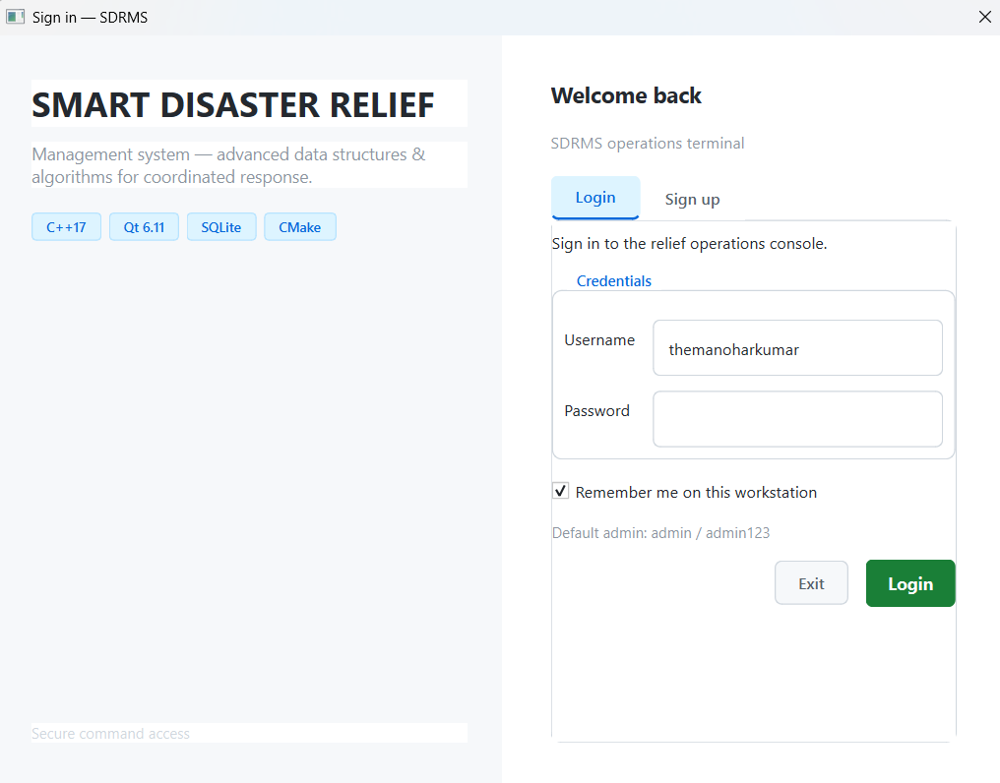
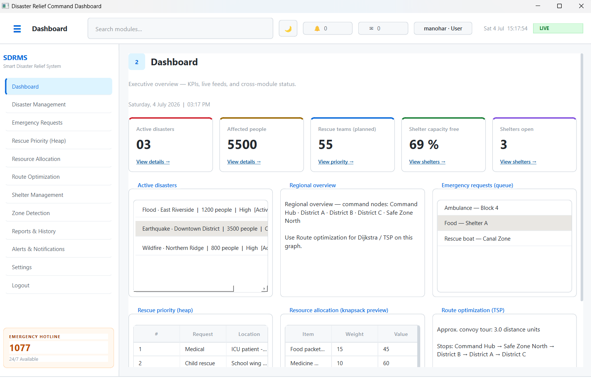

# 🚨 Smart Disaster Relief Management System (SDRMS)

<p align="center">
  
  
  
  
  
</p>

---

## 📖 Project Overview

The **Smart Disaster Relief Management System (SDRMS)** is a production-grade desktop application built using **C++17** and the **Qt 6.11 framework**. It integrates native backend algorithms with an advanced dashboard interface. SDRMS is designed to serve as a comprehensive dashboard for emergency agencies, enabling real-time operation coordination, resource dispatching, priority queue triage, and risk assessment.

This application is engineered as a **resume-ready software portfolio highlight**. It moves away from simple console-based algorithm demos, embedding complex Data Structures and Algorithms (DSA) into a modern, fully-realized user interface backed by an **SQLite database**, persistent settings, and custom styled dark/light themes.

---

## 🖥️ System Architecture & UI

- **Split-Screen Authentication:** Modern login interface featuring a brand introduction pane highlighting the project's technology stack next to an input card.
- **Modern Clean Workspace:** Fully custom stylesheet inspired by modern web dashboard design systems (solid left-accent active indicators, flat tables, clean custom scrollbars).

### Screenshots

#### Secure Login Panel


#### Live Dashboard Overview


#### Disaster Registration & Tracking


#### Shelter Capacity & Bed Utilization


#### Admin User Management Control


---

## ✨ Features & Functionality

### 🔐 Secure Database-Backed Authentication
- SQLite-backed signup and login panels.
- Passwords secured via **SHA-256** hashing.
- Role-based UI access control (hides "User Management" from non-admin accounts).

### 📊 Executive KPI Dashboard
- Clickable KPI tiles (Active Disasters, Affected People, Free Shelter Beds, Open Shelters) that instantly trigger page navigation.
- Live clock synchronize widget with high-priority "LIVE" status badge.
- Search-to-filter sidebar that matches navigation options instantly as you type.

### 🔔 Live Badges & Panel Feeds
- Auto-refreshing badging pipeline that queries unread admin alerts and messages every 2 seconds.
- Modals for notifications and messages with "Mark All Read" functions.
- Automatic alert routing: registering new disasters immediately sends alerts to the admin's notification panel and message inbox.

---

## 🧠 Data Structures & Algorithms (DSA)

| Module | Algorithm / Data Structure | Purpose | Complexity |
|---|---|---|---|
| **Rescue Priority** | Max-Heap (Priority Queue) | Dynamic triage sorting of critical relief operations | $O(\log n)$ insert/delete |
| **Resource Allocation** | 0/1 Knapsack (Dynamic Programming) | Optimal cargo weight distribution for dispatch vans | $O(n \cdot W)$ time/space |
| **Route Planning** | Dijkstra's Shortest Path | Finding safest roads avoiding dynamically blocked paths | $O((V+E) \log V)$ |
| **Convoy Optimization** | Traveling Salesman Problem (TSP) | Exact backtracking solver for multi-stop supply rounds | $O(n^2 \cdot 2^n)$ |
| **Zone Scanning** | BFS & DFS Traversals | Graph reachability scanning and connectivity detection | $O(V+E)$ |
| **Audit Trails** | Stack (LIFO) | Operation logging and undo actions history | $O(1)$ push/pop |

---

## 🗂️ Project Code Structure

```
SmartDisasterSystem/
├── 📄 main.cpp                       # App loop, SQLite init, auth gating
├── 📄 database.h/cpp                 # SQLite database helper (Singleton pattern)
├── 📄 thememanager.h/cpp             # Custom QSS engine (instant theme toggle)
├── 📄 loginwindow.h/cpp/ui           # Split screen login & signup dialog
├── 📄 dashboard.h/cpp/ui             # Main dashboard UI shell & sidebar
├── 📄 appdata.h/cpp                  # Central application data model holding memory states
├── 📄 filemanager.h/cpp              # Flat file save/load backup pipeline
│
├── ── DSA Modules ──────────────────────────────────────────────────────────
│   ├── graph.h/cpp                   # Custom adjacency list graph (Dijkstra, BFS, DFS)
│   ├── heap_priority.h/cpp           # Max-Heap template implementation
│   ├── knapsack.h/cpp                # Dynamic Programming Knapsack solver
│   ├── tsp.h/cpp                     # Backtracking exact TSP pathfinder
│   ├── emergency_queue.h/cpp         # Request queue container with cancelById()
│   ├── shelter.h/cpp                 # Shelter structure & capacity allocator
│   └── stack_history.h/cpp           # Undo/history stack representation
│
└── 📁 pages/                         # Dashboard tabs (modular views)
    ├── overview_page.h/cpp           # Executive KPI tiles & feed previews
    ├── disaster_page.h/cpp           # Disaster registry form with inline CRUD
    ├── emergency_page.h/cpp          # FIFO Emergency Queue table & dispatcher
    ├── priority_page.h/cpp           # Max-Heap triage scheduler
    ├── resource_page.h/cpp           # Knapsack resource calculator
    ├── route_page.h/cpp              # Road network pathfinder & block manager
    ├── shelter_page.h/cpp            # Shelter capacity visual progress bars
    ├── zone_page.h/cpp               # BFS/DFS path visualizer & zone detector
    ├── reports_page.h/cpp            # Historical reports generator
    ├── alerts_page.h/cpp             # DB notifications and history loggers
    ├── users_page.h/cpp              # User database grid (enable/disable guards)
    └── settings_page.h/cpp           # QSettings workspace preferences panel
```

---

## 🛠️ Compilation & Setup

### ⚙️ Prerequisites
- **Qt SDK:** Qt 6.6+ (tested on Qt 6.11.0) with **Widgets** and **Sql** components.
- **Compiler:** MinGW-w64 GCC 13+ (or MSVC equivalent).
- **Build Tool:** CMake 3.16+.

### 🚀 Building and Running
To build the release version using CMake:

```powershell
# Configure build folder
cmake -B build-release -G "MinGW Makefiles" `
  -DCMAKE_PREFIX_PATH="D:/Qt/6.11.0/mingw_64" `
  -DCMAKE_BUILD_TYPE=Release

# Compile the target
cmake --build build-release --parallel 4

# Run windeployqt to copy required DLLs and WebEngine resources
D:\Qt\6.11.0\mingw_64\bin\windeployqt.exe build-release\SmartDisasterRelief.exe

# Start the application
.\build-release\SmartDisasterRelief.exe
```

---

## 🔒 Default Test User

| Username | Password | Role |
|---|---|---|
| **admin** | `admin123` | Administrator (full privileges) |

---

<p align="center">Designed and developed with ❤️ in C++17 and Qt 6.11</p>
